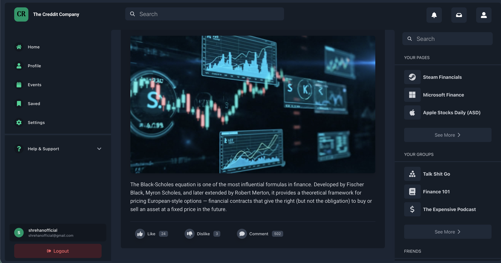
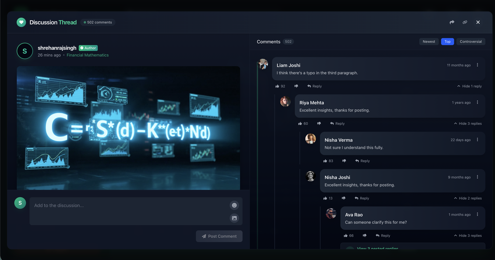
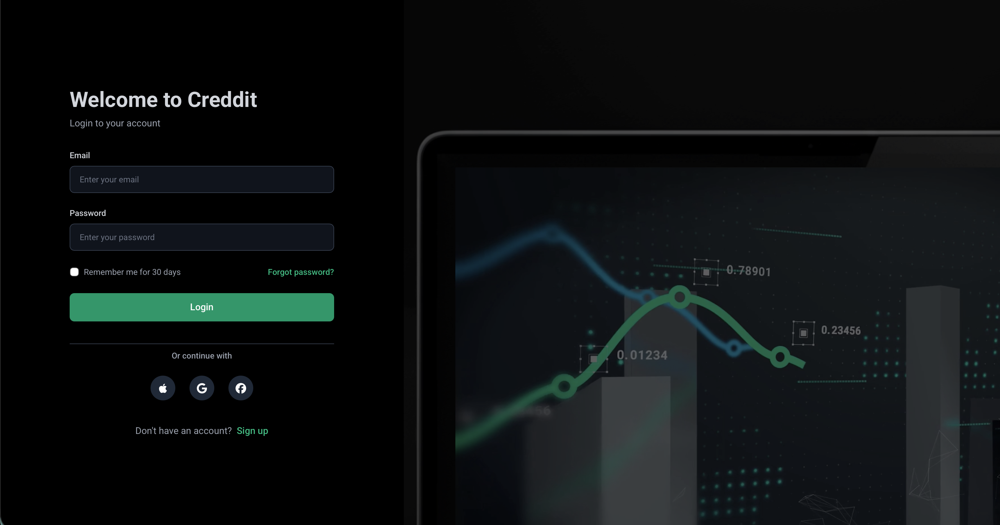

# Social Media Platform with Next.js & FastAPI

This project demonstrates a modern full-stack social media application that integrates a Next.js frontend with a FastAPI backend. The application features a stylish UI built with Tailwind CSS and Framer Motion animations, along with a robust authentication system using JWT tokens.



## Project Structure

- **Frontend**: Next.js app with Tailwind CSS for styling and Framer Motion for animations
- **Backend**: FastAPI with JWT authentication and SQLAlchemy for database operations
- **Authentication**: JWT-based auth with protected routes and server-side validation

## Features

- **User Authentication**: Complete login/signup system with JWT
- **Protected Routes**: Middleware to prevent unauthorized access
- **Social Media Style UI**: Post creation, commenting, and user interactions
- **Profile Management**: User profile viewing and editing
- **Responsive Design**: Mobile-friendly UI using Tailwind CSS

### Interactive Comment Section


### User Authentication Screens
<div style="display: flex; justify-content: space-between; margin-bottom: 20px;">
  
  
</div>

## Getting Started

For logging in you can create an account or use the following  credentials.   
Email: shrehanofficial@gmail.com  
Password: 123456


### Prerequisites

- Node.js 18+ (or Docker)
- Python 3.8+ (for backend)
- Docker and Docker Compose (optional, for containerized setup)

### Using Docker

#### Production Build

1. Build and run the Docker containers:

```bash
# Run both frontend and backend using the build script (resolves package-lock issues)
./docker-build.sh prod

# Or using the standard script (if package-lock is in sync)
./docker.sh prod

# Or using Docker Compose directly
docker-compose up --build
```

If you encounter package.json vs package-lock.json mismatch errors, use:

```bash
# Force rebuild without cache
./docker.sh rebuild
```

2. Access the frontend at http://localhost:3000
3. Access the backend API at http://localhost:8000

#### Development Mode

1. Run the development containers:

```bash
# Run both in development mode
./docker.sh dev

# Or using Docker Compose directly
docker-compose -f docker-compose.dev.yml up --build
```

2. Access the frontend with hot-reloading at http://localhost:3000
3. Access the backend API with auto-reload at http://localhost:8000

#### Other Docker Commands

```bash
# Start only the backend
./docker.sh backend

# Start only the frontend
./docker.sh frontend

# Stop all containers
./docker.sh down

# Clean up Docker resources
./docker.sh clean
```

### Manual Setup

```

### Manual Setup

1. Install dependencies:

```bash
npm install
# or
yarn
# or
pnpm install
```

2. Run the development server:

```bash
npm run dev
# or
yarn dev
# or
pnpm dev
```

The frontend will be available at [http://localhost:3000](http://localhost:3000).

### Backend Setup

1. Navigate to the backend directory:

```bash
cd backend
```

2. Install Python dependencies:

```bash
pip install -r requirements.txt
```

3. Run the FastAPI server:

```bash
uvicorn main:app --reload
```

The backend API will be available at [http://localhost:8000](http://localhost:8000).

## API Integration

The frontend connects to the FastAPI backend using axios. The API utilities are organized in the `app/lib/api.tsx` file, which includes:

- Authentication endpoints (login, register, profile)
- Post management (create, read, update, delete)
- Comment functionality (add, edit, delete)

The authentication system uses JWT tokens stored in cookies for persistent sessions and protected routes.

### API Architecture
```
Frontend (Next.js) <--> API Middleware <--> FastAPI Backend <--> Database
```

## Environment Variables

Create a `.env.local` file in the root directory with the following variables:

```
NEXT_PUBLIC_API_URL=http://localhost:8000
```

## Development Notes

- The project includes fallback sample data in the `data/` directory for development without the backend
- API calls automatically fallback to sample data if the backend is unavailable
- Protected routes redirect to login when accessing without authentication

## Key Features

### 🔐 Authentication
- Secure JWT-based authentication
- Protected routes and API endpoints
- User registration and login

### 📱 Modern UI
- Responsive design works on all devices
- Dark mode interface
- Animations powered by Framer Motion

### 🔄 Real-time Interactions
- Comment sections with sorting options (Top, Newest, Controversial)
- Upvote/downvote functionality
- Threaded comment replies

### 🌐 Full-Stack Implementation
- Next.js frontend with TypeScript
- FastAPI backend with SQLAlchemy
- Docker containerization for easy deployment

## Technologies Used

<div style="display: flex; flex-wrap: wrap; gap: 10px;">
  
  
  
  
  
  
</div>

---

Made with ❤️ by The Dev Team
